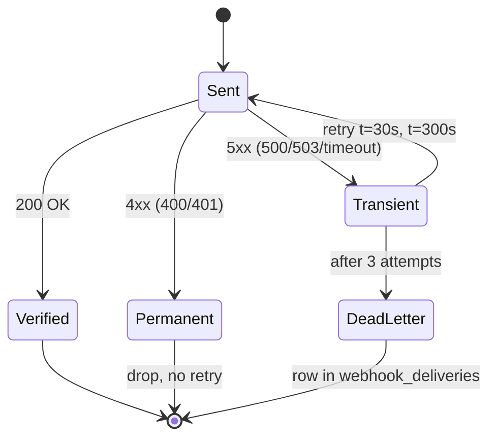
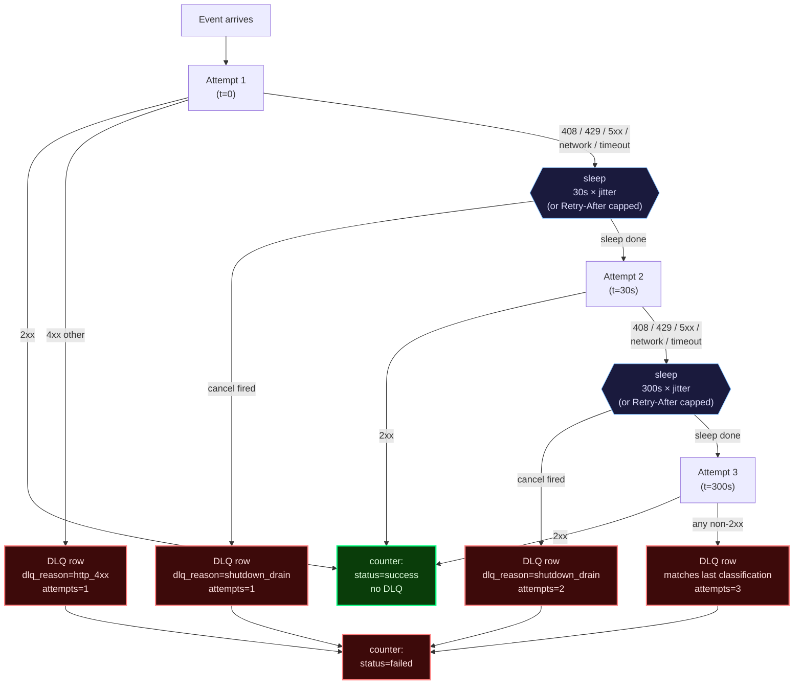
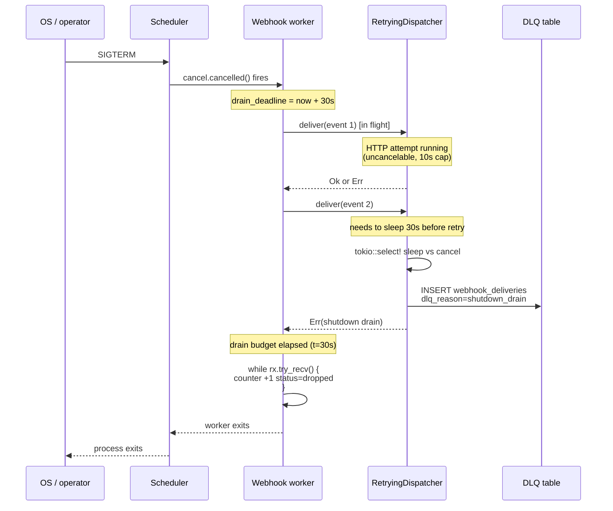

# Cronduit Webhooks

Cronduit emits Standard Webhooks v1 deliveries on terminal job-run events
(`failed`, `timeout`, `stopped` by default — configurable per job). This
document is the operator-facing hub for receiver implementation and
verification. For TOML config field reference, see
[`CONFIG.md`](./CONFIG.md). For the architectural picture, see
[`SPEC.md`](./SPEC.md). For a step-by-step walkthrough, start with
[`QUICKSTART.md`](./QUICKSTART.md).

## Table of contents

1. [Overview](#overview)
2. [Three required headers](#three-required-headers)
3. [SHA-256 only](#sha-256-only)
4. [Secret rotation](#secret-rotation)
5. [Constant-time compare](#constant-time-compare)
6. [Anti-replay window](#anti-replay-window)
7. [Idempotency](#idempotency)
8. [Retry-aware response codes](#retry-aware-response-codes)
9. [Receiver examples](#receiver-examples)
10. [Loopback Rust mock](#loopback-rust-mock)
11. [Retry schedule](#retry-schedule)
12. [Retry-After header handling](#retry-after-header-handling)
13. [Dead-letter table (`webhook_deliveries`)](#dead-letter-table-webhook_deliveries)
14. [Drain on shutdown](#drain-on-shutdown)
15. [HTTPS / SSRF posture](#https--ssrf-posture)
16. [Metrics family (`cronduit_webhook_*`)](#metrics-family-cronduit_webhook_)

---

## Overview

Cronduit signs every webhook delivery using the [Standard Webhooks v1
specification](https://github.com/standard-webhooks/standard-webhooks/blob/main/spec/standard-webhooks.md).
The wire format (signing-string composition, base64 alphabet, header
semantics) is the spec's — this document does NOT paraphrase the spec; it
points to it and documents only the cronduit-specific operator-facing
surface (which fields ship, how to verify, retry semantics, secret
rotation).

Operators implementing a receiver should:

1. Read the [Standard Webhooks v1 spec](https://github.com/standard-webhooks/standard-webhooks/blob/main/spec/standard-webhooks.md) (~10 minutes).
2. Pick a reference receiver in their language: [Python](../examples/webhook-receivers/python/README.md), [Go](../examples/webhook-receivers/go/README.md), or [Node](../examples/webhook-receivers/node/README.md).
3. Run it against a real cronduit delivery via the corresponding `just uat-webhook-receiver-{python,go,node}` recipe.

The full delivery flow:

```mermaid
sequenceDiagram
    autonumber
    participant Cron as Cronduit (HttpDispatcher)
    participant Recv as Receiver (Python/Go/Node)
    participant Log as Receiver log

    Note over Cron: RunFinalized event
    Cron->>Cron: build payload (16 fields)
    Cron->>Cron: serialize → body_bytes (compact JSON)
    Cron->>Cron: webhook_id = ULID
    Cron->>Cron: webhook_ts = now() Unix seconds
    Cron->>Cron: sig = base64(HMAC-SHA256(secret, "${id}.${ts}.${body}"))
    Cron->>Recv: POST /<path><br/>webhook-id, webhook-timestamp,<br/>webhook-signature: v1,&lt;b64&gt;<br/>body=body_bytes
    Recv->>Recv: parse 3 headers (400 if missing)
    Recv->>Recv: |now - ts| ≤ 300s? (400 if not)
    Recv->>Recv: HMAC-SHA256(secret, id.ts.body) → expected
    Recv->>Recv: constant_time_compare(expected, decoded_sig)
    alt match
        Recv->>Log: verified run_id=N status=...
        Recv-->>Cron: 200 OK
    else mismatch
        Recv-->>Cron: 401 Unauthorized
    else exception
        Recv-->>Cron: 503 Service Unavailable
    end
    Note over Cron: Phase 18: log only<br/>Phase 20: 4xx=drop, 5xx=retry
```

---

## Three required headers

Every signed delivery carries exactly three Standard Webhooks v1 headers
(cronduit also sends `content-type: application/json`):

| Header | Format | Source |
|---|---|---|
| `webhook-id` | 26-char Crockford-base32 ULID | `ulid::Ulid::new().to_string()` |
| `webhook-timestamp` | 10-digit Unix epoch seconds | `chrono::Utc::now().timestamp()` |
| `webhook-signature` | `v1,<base64-of-hmac-sha256>` (space-delimited multi-token; cronduit currently emits one) | HMAC-SHA256 over `${webhook-id}.${webhook-timestamp}.${body}` raw bytes |

The signature header is space-delimited so future cronduit versions can
emit multiple tokens during multi-secret rotation (v1.3+ candidate). Modern
receivers SHOULD parse all `v1,...` tokens and accept on first match; the
[shipped reference receivers](#receiver-examples) demonstrate this.

---

## SHA-256 only

**Cronduit v1.2 ships SHA-256 only.** No algorithm-agility (SHA-384/512/Ed25519/etc.)
and no multi-secret rotation cronduit-side; secret rotation lives on the
receiver via a dual-secret verify window (see [§4 Secret rotation](#secret-rotation)).

If your operator workflow requires algorithm-agility, file a v1.3 roadmap
issue. The Standard Webhooks v1 spec reserves `v1a` (Ed25519) and `v1b`
(asymmetric) tokens for future use; cronduit currently emits only `v1`.

---

## Secret rotation

Cronduit holds **one secret per job** (the `webhook.secret` config value,
typically `${WEBHOOK_SECRET}` env-interpolated). Multi-secret rotation
happens on the **receiver side** with a dual-secret verify window:

1. Receiver enters dual-secret mode: it accepts deliveries signed by
   either OLD or NEW secret.
2. Operator updates cronduit's `webhook.secret` config value to the NEW
   secret, reloads cronduit (SIGHUP / `POST /api/reload`).
3. After all in-flight retries drain (Phase 20 max retry window: ~5 min),
   the receiver drops OLD secret support and continues with NEW only.

The reference receivers shipped with cronduit (Python, Go, Node) are
SINGLE-secret for clarity; operators implementing rotation extend the
`verify_signature` function to iterate over a `[OLD, NEW]` secret list and
accept on first match.

---

## Constant-time compare

Constant-time HMAC comparison is the central security requirement of
WH-04. **Plain `==` on hex/base64 strings is forbidden** — short-circuit
comparison leaks timing information that lets an attacker extract the
expected signature one byte at a time.

Each language ships a stdlib constant-time primitive:

| Language | Primitive | Stdlib module | Length-guard required? |
|---|---|---|---|
| Python | [`hmac.compare_digest(a, b)`](https://docs.python.org/3/library/hmac.html#hmac.compare_digest) | `hmac` | No (handles unequal length internally) |
| Go | [`hmac.Equal(macA, macB)`](https://pkg.go.dev/crypto/hmac#Equal) | `crypto/hmac` | No (handles unequal length internally) |
| Node | [`crypto.timingSafeEqual(bufA, bufB)`](https://nodejs.org/api/crypto.html#cryptotimingsafeequala-b) | `crypto` (built-in) | **YES** — throws `RangeError` on length mismatch |

The Node receiver requires a MANDATORY length guard
(`if (received.length !== expected.length) continue;`) before every
`crypto.timingSafeEqual` call to avoid a `RangeError` on malformed
signatures. See the inline rationale in
[`examples/webhook-receivers/node/receiver.js`](../examples/webhook-receivers/node/receiver.js)
(search for "length guard MANDATORY") — the receiver source is the
single source of truth for that rationale, this hub doc just flags
that it exists.

The receiver verify decision tree:

```mermaid
flowchart TD
    A[POST request arrives] --> B{All 3 headers present?}
    B -- no --> X1[400 Bad Request]
    B -- yes --> C{webhook-timestamp parses as int?}
    C -- no --> X1
    C -- yes --> D{|now - ts| ≤ 300s?}
    D -- no --> X1
    D -- yes --> E{webhook-signature starts with 'v1,'?}
    E -- no --> X2[401 Unauthorized]
    E -- yes --> F[Decode each v1,&lt;b64&gt; token<br/>space-delimited]
    F --> G[Compute HMAC-SHA256<br/>over id.ts.body]
    G --> H{Length-equal AND<br/>constant-time match<br/>against ANY token?}
    H -- no --> X2
    H -- yes --> I[Log verified outcome]
    I --> Y[200 OK]

    style X1 fill:#fdd
    style X2 fill:#fdd
    style Y fill:#dfd
```

---

## Anti-replay window

Each delivery's `webhook-timestamp` MUST be within 5 minutes of the
receiver's clock — `MAX_TIMESTAMP_DRIFT_SECONDS = 300` per the [Standard
Webhooks v1 reference implementation](https://github.com/standard-webhooks/standard-webhooks/blob/main/libraries/javascript/src/index.ts)
(`WEBHOOK_TOLERANCE_IN_SECONDS = 5 * 60`).

A stale-timestamp delivery is rejected with **400 Bad Request** (permanent
— no retry). The [retry-aware response codes table](#retry-aware-response-codes)
documents this contract.

The drift window is hard-coded in the reference receivers. Operators who
need a different window edit `MAX_TIMESTAMP_DRIFT_SECONDS` in their fork
of the receiver. Configurability is not in v1.2's scope.

---

## Idempotency

Cronduit may redeliver a webhook on transient receiver failures (Phase
20: 5xx response → retry t=30s, t=300s; max 3 attempts). To prevent
side-effect duplication, receivers SHOULD dedupe by `webhook-id`:

- **In-memory short-TTL Set/Map** (sufficient for stateless receivers
  with low traffic; 5-minute TTL covers the retry window).
- **DB unique constraint on `webhook-id`** (durable; survives receiver
  restarts).

The shipped reference receivers ship a comment block, NOT working dedup
code (D-10). Working dedup needs a TTL story and state management that
distracts from the HMAC focus. Operators implementing production
receivers add their own.

---

## Retry-aware response codes

Each receiver outcome maps to a specific HTTP status code that cronduit
interprets per the table below. **This contract is locked at v1.2.0;
Phase 20's retry implementation inherits it unchanged.**

| Receiver outcome | HTTP status | Cronduit (Phase 20) interpretation |
|---|---|---|
| Missing/malformed headers | 400 | Permanent — drop, no retry |
| Timestamp drift > 5 min | 400 | Permanent — drop, no retry |
| HMAC mismatch | 401 | Permanent — drop, no retry |
| Verify success | 200 | Success — counter increment |
| Unexpected exception | 503 | Transient — Phase 20 retries (3 attempts t=0/30s/300s) |

The retry state machine:



---

## Receiver examples

Three reference receivers ship with cronduit. Each is stdlib-only
(no `pip install`/`go mod download`/`npm install` required), ~80-300 LOC,
and demonstrates constant-time HMAC verify + 5-min anti-replay + the
D-12 retry-aware response code mapping.

| Language | Port | Path |
|---|---|---|
| Python | 9991 | [`examples/webhook-receivers/python/`](../examples/webhook-receivers/python/README.md) |
| Go | 9992 | [`examples/webhook-receivers/go/`](../examples/webhook-receivers/go/README.md) |
| Node | 9993 | [`examples/webhook-receivers/node/`](../examples/webhook-receivers/node/README.md) |

Each receiver supports two modes:

- **HTTP server mode** (default) — listens on `127.0.0.1:<port>`, verifies
  live deliveries from cronduit. Set `WEBHOOK_SECRET_FILE` to point at the
  secret file your cronduit instance signs with.
- **`--verify-fixture <dir>` mode** — reads the 5 files in
  `tests/fixtures/webhook-v1/`, runs the same `verify_signature`
  function used by the HTTP path, exits 0 on canonical match / 1 on
  tamper. Used by the CI `webhook-interop` matrix job to lock the wire
  format across all 3 languages.

The `just` recipes are the operator-facing surface:

| Recipe | Purpose |
|---|---|
| `just uat-webhook-receiver-python` | Run Python receiver against real cronduit delivery |
| `just uat-webhook-receiver-go` | Run Go receiver against real cronduit delivery |
| `just uat-webhook-receiver-node` | Run Node receiver against real cronduit delivery |
| `just uat-webhook-receiver-python-verify-fixture` | Verify Python receiver against fixture (canonical + 3 tamper variants) |
| `just uat-webhook-receiver-go-verify-fixture` | Verify Go receiver against fixture (canonical + 3 tamper variants) |
| `just uat-webhook-receiver-node-verify-fixture` | Verify Node receiver against fixture (canonical + 3 tamper variants) |

---

## Loopback Rust mock

Phase 18 ships a Rust loopback mock at
[`examples/webhook_mock_server.rs`](../examples/webhook_mock_server.rs)
that listens on port 9999 and **always returns 200 — it does not verify
HMAC**. Use it for inspecting raw headers, payload shape, and signature
format during initial integration; switch to one of the verifying
receivers (Python/Go/Node) once you've confirmed the wire format end to
end.

Run via `just uat-webhook-mock`. Pair with `just uat-webhook-fire <JOB_NAME>`
to force a delivery and `just uat-webhook-verify` to tail the receiver
log.

---

## Retry schedule

Cronduit retries failed webhook deliveries up to 3 times on the locked schedule
`t = 0, t = 30s, t = 300s`, with each delay multiplied by a uniform full-jitter
factor in `[0.8, 1.2)`. The schedule is intentionally NOT operator-tunable —
predictability matters more than per-job customization for v1.2 (deferred to v1.3 if
operator demand surfaces).

| Attempt | Base delay | Jittered range | Trigger condition |
|---------|------------|----------------|-------------------|
| 1       | 0s         | 0s             | First delivery    |
| 2       | 30s        | 24s..36s       | Attempt 1 returned a transient error |
| 3       | 300s       | 240s..360s     | Attempt 2 returned a transient error |

Total chain wall time without `Retry-After` headers: ≈ 0 + 30s × jitter + 300s ×
jitter + 10s (final attempt timeout) ≈ **6.7 minutes** worst case.

### Classification table

| HTTP / outcome | Classification | Behavior |
|---|---|---|
| 200..=299 | success | counter `_deliveries_total{status="success"}` increments; no retry; no DLQ row |
| 408 (Request Timeout) | transient | retry per schedule (treated as 5xx-class for retry purposes) |
| 429 (Too Many Requests) | transient | retry per schedule; honors `Retry-After` (see next section) |
| 4xx (other) | permanent | DLQ row `dlq_reason='http_4xx'`, `attempts=1`, no retry |
| 5xx | transient | retry per schedule; honors `Retry-After` |
| reqwest network error | transient | retry per schedule; DLQ `dlq_reason='network'` if exhausted |
| reqwest timeout (10s per attempt — see "Drain on shutdown") | transient | retry per schedule; DLQ `dlq_reason='timeout'` if exhausted |

### Diagram



---

## Retry-After header handling

Cronduit honors the `Retry-After` HTTP header on `429` and `5xx` responses
(RFC 7231 §7.1.3). Only the **integer-seconds** form is supported in v1.2;
the HTTP-date form is RFC-compliant but not implemented (logs a WARN and
falls back to the schedule). HTTP-date support is a v1.3 candidate if a real
receiver demands it.

### Cap math

`Retry-After` is honored within a per-slot cap so a misbehaving receiver cannot
blow past Phase 20's predictable schedule:

```
delay = max(locked_schedule[next_attempt], retry_after_seconds)
delay = min(delay, schedule[next_attempt + 1] * 1.2)   # cap
# last attempt: cap = schedule[next_attempt] * 1.2
```

Worked table (locked schedule `[0, 30s, 300s]`):

| Pre-attempt slot | Slot delay | `Retry-After` floor | `Retry-After` cap | Worst-case wait |
|------------------|------------|---------------------|-------------------|-----------------|
| Before attempt 2 | 30s × jitter | 30s | `300s × 1.2 = 360s` | 360s |
| Before attempt 3 | 300s × jitter | 300s | `300s × 1.2 = 360s` (last-slot fallback) | 360s |

Total chain worst-case under maximally-aggressive `Retry-After`:
`360s + 360s + 10s ≈ 12 minutes`.

### Receiver guidance

- Want more aggressive backoff than the schedule? Return **5xx + `Retry-After`** (transient + delay hint).
- Want to refuse a request permanently? Return **400-or-equivalent 4xx** (cronduit drops at attempt 1, no retry).
- HTTP-date `Retry-After`? Cronduit logs WARN and falls back to schedule.

---

## Dead-letter table (`webhook_deliveries`)

Every webhook delivery that fails to reach 2xx is recorded in the
`webhook_deliveries` table — one row per failed delivery (regardless of
attempt count). First-attempt successes write NO row.

### Schema

```sql
CREATE TABLE webhook_deliveries (
    id               -- internal autoincrement
    run_id           -- FK → job_runs(id)
    job_id           -- FK → jobs(id)
    url              -- as-configured (after env-var interp)
    attempts         -- 1..=3
    last_status      -- HTTP status if any (NULL on network/timeout/shutdown)
    last_error       -- truncated reqwest error (≤500 chars)
    dlq_reason       -- closed enum: http_4xx | http_5xx | network | timeout | shutdown_drain
    first_attempt_at -- RFC3339
    last_attempt_at  -- RFC3339
);
CREATE INDEX idx_webhook_deliveries_last_attempt ON webhook_deliveries (last_attempt_at);
```

**No payload, no headers, no signature is stored.** v1.2 prioritizes secret/PII
hygiene over replay; receivers can re-derive the payload from `run_id` if needed.

### `dlq_reason` values

| Value | When written |
|-------|--------------|
| `http_4xx` | Receiver returned a 4xx other than 408/429 — permanent rejection, attempt 1 only |
| `http_5xx` | Receiver returned 5xx for all 3 attempts (or 408/429 — treated as transient) |
| `network` | reqwest transport error for all 3 attempts (connection refused, DNS failure, etc.) |
| `timeout` | reqwest timeout (10s per attempt, P18) for all 3 attempts |
| `shutdown_drain` | SIGTERM mid-chain — see "Drain on shutdown" |

### Operator queries

What failed in the last hour?
```sql
SELECT * FROM webhook_deliveries
  WHERE last_attempt_at > datetime('now', '-1 hour')
  ORDER BY last_attempt_at DESC;
```
(Postgres: replace `datetime('now', '-1 hour')` with `now() - interval '1 hour'`.)

Which jobs are losing the most deliveries this week?
```sql
SELECT job_id, dlq_reason, COUNT(*)
  FROM webhook_deliveries
  WHERE last_attempt_at > datetime('now', '-7 days')
  GROUP BY job_id, dlq_reason
  ORDER BY 3 DESC;
```

Which deliveries were lost specifically to SIGTERM?
```sql
SELECT * FROM webhook_deliveries
  WHERE dlq_reason = 'shutdown_drain'
  ORDER BY last_attempt_at DESC;
```

### Retention

Rows are pruned daily by the existing retention pruner using the same
`[server].log_retention` knob (default `90d`) — same cadence as `job_logs`
and `job_runs`. No separate config field.

---

## Drain on shutdown

On SIGTERM, the webhook worker enters drain mode and continues delivering
queued events for up to `[server].webhook_drain_grace` (default `30s`).
In-flight HTTP requests run to completion — they are NOT cancelled mid-flight.

### Worst-case ceiling

`webhook_drain_grace + 10s`. The 10s is reqwest's per-attempt timeout (P18 D-18,
not operator-tunable in v1.2). For the default `webhook_drain_grace = "30s"`,
that's a 40-second worst case.

Operators with strict shutdown budgets should tune both knobs:

```toml
[server]
shutdown_grace       = "20s"   # scheduler waits for running jobs
webhook_drain_grace  = "10s"   # worker drains webhooks
# → worst-case shutdown = 10s + 10s = 20s
```

The two budgets are sequential — `shutdown_grace` covers in-flight job execution
(the scheduler's wait loop); `webhook_drain_grace` covers webhook queue drain
AFTER the scheduler finishes (no overlap, D-17).

### Diagram



### What gets dropped vs DLQ-recorded

- **Mid-chain (already pulled from queue, in retry loop):** Cancel-aware sleep
  bails out → DLQ row with `dlq_reason='shutdown_drain'`, `attempts=N` (actual
  count). The metric `_deliveries_total{status="failed"}` increments.
- **Still queued (not yet pulled at deadline):** Drained-and-dropped via
  `rx.try_recv()` loop; `_deliveries_total{status="dropped"}` increments per
  event; **no DLQ row** (post-channel only).
- **In-flight HTTP:** Allowed to outlast the budget by up to 10s (reqwest cap).

---

## HTTPS / SSRF posture

Cronduit gates outbound webhook URLs at config-load time. `https://` is required
for non-loopback / non-RFC1918 destinations; `http://` is permitted ONLY for the
locked allowlist below.

### Allowed `http://` destinations

| Range | Notes |
|-------|-------|
| `127.0.0.0/8` | IPv4 loopback |
| `::1` | IPv6 loopback |
| `10.0.0.0/8` | RFC 1918 private |
| `172.16.0.0/12` | RFC 1918 private |
| `192.168.0.0/16` | RFC 1918 private |
| `fd00::/8` | IPv6 ULA (cronduit accepts the broader RFC 4193 `fc00::/7` range via the stdlib `Ipv6Addr::is_unique_local()` helper) |
| `localhost` (literal hostname) | Special-cased; case-insensitive |

Anything else over `http://` is rejected at LOAD time:

```
[[jobs]] `backup-nightly`: webhook.url `http://example.com` requires HTTPS for
non-loopback / non-RFC1918 destinations. Use `https://` or one of the allowed
local nets: 127/8, ::1, 10/8, 172.16/12, 192.168/16, fd00::/8.
```

HTTP-allowed URLs emit a startup INFO log naming the URL + classified-net
(`localhost`, `loopback`, `RFC1918`, `ULA`) so operators can confirm the
validator's decision matches their intent.

### Accepted residual risk: hostname → public IP

Cronduit does **NOT** resolve DNS at config-load. A hostname that is not the
literal string `localhost` is rejected for HTTP, even if it resolves to a
private IP via `/etc/hosts` or local DNS. Conversely, `localhost` (the literal
hostname) is accepted regardless of how it resolves on the host. This is an
accepted residual SSRF risk per **WH-08**; a full SSRF allow/block-list filter
is deferred to v1.3.

### Threat Model

Phase 20 ships the operational mitigations above. The full threat model
discussion (including the operator-with-UI-access widening of the SSRF blast
radius, the loopback-bound default mitigation, and the reverse-proxy/auth
deployment posture) lands in
**[Threat Model 5 — Webhook Outbound, full close-out in Phase 24](../THREAT_MODEL.md)**.
Phase 20 is intentionally a forward-pointer; the canonical TM5 entry is part of
the v1.2.0 milestone close-out.

---

## Metrics family (`cronduit_webhook_*`)

Phase 20 introduces a labeled counter family + histogram + gauge, replacing
the v1.2.0-rc.0 (P18) flat counters. The metrics are eagerly described and
zero-baselined at boot, so Prometheus alerts work from the first scrape.

### Surface

| Metric | Type | Labels | Notes |
|--------|------|--------|-------|
| `cronduit_webhook_deliveries_total` | counter | `{job, status}` | `status ∈ {success, failed, dropped}` (closed enum) |
| `cronduit_webhook_delivery_duration_seconds` | histogram | `{job}` | Per-attempt HTTP duration; buckets `[0.05, 0.1, 0.25, 0.5, 1.0, 2.5, 5.0, 10.0]` |
| `cronduit_webhook_queue_depth` | gauge | none | Sampled at `rx.recv()` boundary; approximate under contention |
| `cronduit_webhook_delivery_dropped_total` | counter | none | **PRESERVED from v1.1 (P15)** — channel-saturation drops only (NOT drain drops) |

### Breaking change in v1.2.0-rc.1

The P18 (v1.2.0-rc.0) flat counters are **REMOVED**:

| Old (P18) | New (P20) |
|-----------|-----------|
| `cronduit_webhook_delivery_sent_total` | `cronduit_webhook_deliveries_total{status="success"}` |
| `cronduit_webhook_delivery_failed_total` | `cronduit_webhook_deliveries_total{status="failed"}` |

Operators with v1.2.0-rc.0 dashboards must update queries before upgrading.
Sample migration:

```promql
# Before (rc.0):
rate(cronduit_webhook_delivery_failed_total[5m])

# After (rc.1):
sum(rate(cronduit_webhook_deliveries_total{status="failed"}[5m])) by (job)
```

### Dropped-counter semantic split

There are two `dropped`-flavored counters; they measure DIFFERENT things:

| Counter | What it measures | When it fires |
|---------|------------------|---------------|
| `cronduit_webhook_delivery_dropped_total` (UNLABELED, P15) | Channel-saturation drops | Scheduler's `try_send` failed because the bounded mpsc(1024) was full; the dispatcher cannot keep up |
| `cronduit_webhook_deliveries_total{status="dropped"}` (LABELED, P20) | Drain-on-shutdown drops | SIGTERM fired; `webhook_drain_grace` elapsed; remaining queued events dropped |

Both are normal-operation signals — set alerts on each independently:
- `_delivery_dropped_total > 0` for sustained periods → dispatcher CANNOT keep up; investigate receiver health or increase `mpsc` capacity (v1.3 candidate).
- `_deliveries_total{status="dropped"} > 0` after a deploy → SHUTDOWN-time loss; investigate `webhook_drain_grace` or shutdown ordering.

### Histogram buckets

The duration histogram covers 50ms to 10s — chosen to match a healthy receiver
at the bottom and reqwest's per-attempt timeout (P18 D-18) at the top:

```promql
histogram_quantile(0.95,
  sum(rate(cronduit_webhook_delivery_duration_seconds_bucket[5m])) by (le, job)
)
```

### Job names as label values

Cronduit allows arbitrary UTF-8 in `[[jobs]].name` (no validator regex). Job
names appear as `{job=...}` label values; for Prometheus tooling
compatibility, operators should keep names ASCII-safe. Cardinality is bounded
by configured-job-count × 3 (status enum), so the metric scales linearly with
fleet size.
