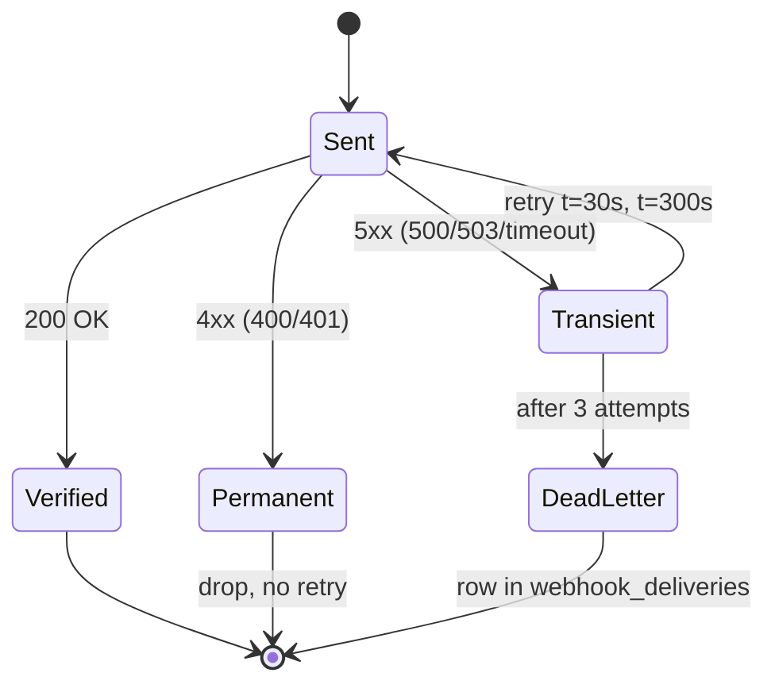

# Cronduit Webhooks

Cronduit emits Standard Webhooks v1 deliveries on terminal job-run events
(`failed`, `timeout`, `stopped` by default — configurable per job). This
document is the operator-facing hub for receiver implementation and
verification. For TOML config field reference, see
[`CONFIG.md`](./CONFIG.md). For the architectural picture, see
[`SPEC.md`](./SPEC.md). For a step-by-step walkthrough, start with
[`QUICKSTART.md`](./QUICKSTART.md).

## Table of contents

1. [Overview](#overview)
2. [Three required headers](#three-required-headers)
3. [SHA-256 only](#sha-256-only)
4. [Secret rotation](#secret-rotation)
5. [Constant-time compare](#constant-time-compare)
6. [Anti-replay window](#anti-replay-window)
7. [Idempotency](#idempotency)
8. [Retry-aware response codes](#retry-aware-response-codes)
9. [Receiver examples](#receiver-examples)
10. [Loopback Rust mock](#loopback-rust-mock)

---

## Overview

Cronduit signs every webhook delivery using the [Standard Webhooks v1
specification](https://github.com/standard-webhooks/standard-webhooks/blob/main/spec/standard-webhooks.md).
The wire format (signing-string composition, base64 alphabet, header
semantics) is the spec's — this document does NOT paraphrase the spec; it
points to it and documents only the cronduit-specific operator-facing
surface (which fields ship, how to verify, retry semantics, secret
rotation).

Operators implementing a receiver should:

1. Read the [Standard Webhooks v1 spec](https://github.com/standard-webhooks/standard-webhooks/blob/main/spec/standard-webhooks.md) (~10 minutes).
2. Pick a reference receiver in their language: [Python](../examples/webhook-receivers/python/README.md), [Go](../examples/webhook-receivers/go/README.md), or [Node](../examples/webhook-receivers/node/README.md).
3. Run it against a real cronduit delivery via the corresponding `just uat-webhook-receiver-{python,go,node}` recipe.

The full delivery flow:

```mermaid
sequenceDiagram
    autonumber
    participant Cron as Cronduit (HttpDispatcher)
    participant Recv as Receiver (Python/Go/Node)
    participant Log as Receiver log

    Note over Cron: RunFinalized event
    Cron->>Cron: build payload (16 fields)
    Cron->>Cron: serialize → body_bytes (compact JSON)
    Cron->>Cron: webhook_id = ULID
    Cron->>Cron: webhook_ts = now() Unix seconds
    Cron->>Cron: sig = base64(HMAC-SHA256(secret, "${id}.${ts}.${body}"))
    Cron->>Recv: POST /<path><br/>webhook-id, webhook-timestamp,<br/>webhook-signature: v1,&lt;b64&gt;<br/>body=body_bytes
    Recv->>Recv: parse 3 headers (400 if missing)
    Recv->>Recv: |now - ts| ≤ 300s? (400 if not)
    Recv->>Recv: HMAC-SHA256(secret, id.ts.body) → expected
    Recv->>Recv: constant_time_compare(expected, decoded_sig)
    alt match
        Recv->>Log: verified run_id=N status=...
        Recv-->>Cron: 200 OK
    else mismatch
        Recv-->>Cron: 401 Unauthorized
    else exception
        Recv-->>Cron: 503 Service Unavailable
    end
    Note over Cron: Phase 18: log only<br/>Phase 20: 4xx=drop, 5xx=retry
```

---

## Three required headers

Every signed delivery carries exactly three Standard Webhooks v1 headers
(cronduit also sends `content-type: application/json`):

| Header | Format | Source |
|---|---|---|
| `webhook-id` | 26-char Crockford-base32 ULID | `ulid::Ulid::new().to_string()` |
| `webhook-timestamp` | 10-digit Unix epoch seconds | `chrono::Utc::now().timestamp()` |
| `webhook-signature` | `v1,<base64-of-hmac-sha256>` (space-delimited multi-token; cronduit currently emits one) | HMAC-SHA256 over `${webhook-id}.${webhook-timestamp}.${body}` raw bytes |

The signature header is space-delimited so future cronduit versions can
emit multiple tokens during multi-secret rotation (v1.3+ candidate). Modern
receivers SHOULD parse all `v1,...` tokens and accept on first match; the
[shipped reference receivers](#receiver-examples) demonstrate this.

---

## SHA-256 only

**Cronduit v1.2 ships SHA-256 only.** No algorithm-agility (SHA-384/512/Ed25519/etc.)
and no multi-secret rotation cronduit-side; secret rotation lives on the
receiver via a dual-secret verify window (see [§4 Secret rotation](#secret-rotation)).

If your operator workflow requires algorithm-agility, file a v1.3 roadmap
issue. The Standard Webhooks v1 spec reserves `v1a` (Ed25519) and `v1b`
(asymmetric) tokens for future use; cronduit currently emits only `v1`.

---

## Secret rotation

Cronduit holds **one secret per job** (the `webhook.secret` config value,
typically `${WEBHOOK_SECRET}` env-interpolated). Multi-secret rotation
happens on the **receiver side** with a dual-secret verify window:

1. Receiver enters dual-secret mode: it accepts deliveries signed by
   either OLD or NEW secret.
2. Operator updates cronduit's `webhook.secret` config value to the NEW
   secret, reloads cronduit (SIGHUP / `POST /api/reload`).
3. After all in-flight retries drain (Phase 20 max retry window: ~5 min),
   the receiver drops OLD secret support and continues with NEW only.

The reference receivers shipped with cronduit (Python, Go, Node) are
SINGLE-secret for clarity; operators implementing rotation extend the
`verify_signature` function to iterate over a `[OLD, NEW]` secret list and
accept on first match.

---

## Constant-time compare

Constant-time HMAC comparison is the central security requirement of
WH-04. **Plain `==` on hex/base64 strings is forbidden** — short-circuit
comparison leaks timing information that lets an attacker extract the
expected signature one byte at a time.

Each language ships a stdlib constant-time primitive:

| Language | Primitive | Stdlib module | Length-guard required? |
|---|---|---|---|
| Python | [`hmac.compare_digest(a, b)`](https://docs.python.org/3/library/hmac.html#hmac.compare_digest) | `hmac` | No (handles unequal length internally) |
| Go | [`hmac.Equal(macA, macB)`](https://pkg.go.dev/crypto/hmac#Equal) | `crypto/hmac` | No (handles unequal length internally) |
| Node | [`crypto.timingSafeEqual(bufA, bufB)`](https://nodejs.org/api/crypto.html#cryptotimingsafeequala-b) | `crypto` (built-in) | **YES** — throws `RangeError` on length mismatch |

The Node receiver's MANDATORY length guard (`if (received.length !== expected.length) continue;`)
prevents the receiver from crashing when a malformed signature with the
wrong byte-length arrives. The length check itself is non-constant-time,
which is fine: HMAC-SHA256 output is fixed at 32 bytes, so a length
mismatch only means the signature is structurally malformed (no secret
material is leaked).

The receiver verify decision tree:

```mermaid
flowchart TD
    A[POST request arrives] --> B{All 3 headers present?}
    B -- no --> X1[400 Bad Request]
    B -- yes --> C{webhook-timestamp parses as int?}
    C -- no --> X1
    C -- yes --> D{|now - ts| ≤ 300s?}
    D -- no --> X1
    D -- yes --> E{webhook-signature starts with 'v1,'?}
    E -- no --> X2[401 Unauthorized]
    E -- yes --> F[Decode each v1,&lt;b64&gt; token<br/>space-delimited]
    F --> G[Compute HMAC-SHA256<br/>over id.ts.body]
    G --> H{Length-equal AND<br/>constant-time match<br/>against ANY token?}
    H -- no --> X2
    H -- yes --> I[Log verified outcome]
    I --> Y[200 OK]

    style X1 fill:#fdd
    style X2 fill:#fdd
    style Y fill:#dfd
```

---

## Anti-replay window

Each delivery's `webhook-timestamp` MUST be within 5 minutes of the
receiver's clock — `MAX_TIMESTAMP_DRIFT_SECONDS = 300` per the [Standard
Webhooks v1 reference implementation](https://github.com/standard-webhooks/standard-webhooks/blob/main/libraries/javascript/src/index.ts)
(`WEBHOOK_TOLERANCE_IN_SECONDS = 5 * 60`).

A stale-timestamp delivery is rejected with **400 Bad Request** (permanent
— no retry). The [retry-aware response codes table](#retry-aware-response-codes)
documents this contract.

The drift window is hard-coded in the reference receivers. Operators who
need a different window edit `MAX_TIMESTAMP_DRIFT_SECONDS` in their fork
of the receiver. Configurability is not in v1.2's scope.

---

## Idempotency

Cronduit may redeliver a webhook on transient receiver failures (Phase
20: 5xx response → retry t=30s, t=300s; max 3 attempts). To prevent
side-effect duplication, receivers SHOULD dedupe by `webhook-id`:

- **In-memory short-TTL Set/Map** (sufficient for stateless receivers
  with low traffic; 5-minute TTL covers the retry window).
- **DB unique constraint on `webhook-id`** (durable; survives receiver
  restarts).

The shipped reference receivers ship a comment block, NOT working dedup
code (D-10). Working dedup needs a TTL story and state management that
distracts from the HMAC focus. Operators implementing production
receivers add their own.

---

## Retry-aware response codes

Each receiver outcome maps to a specific HTTP status code that cronduit
interprets per the table below. **This contract is locked at v1.2.0;
Phase 20's retry implementation inherits it unchanged.**

| Receiver outcome | HTTP status | Cronduit (Phase 20) interpretation |
|---|---|---|
| Missing/malformed headers | 400 | Permanent — drop, no retry |
| Timestamp drift > 5 min | 400 | Permanent — drop, no retry |
| HMAC mismatch | 401 | Permanent — drop, no retry |
| Verify success | 200 | Success — counter increment |
| Unexpected exception | 503 | Transient — Phase 20 retries (3 attempts t=0/30s/300s) |

The retry state machine:



---

## Receiver examples

Three reference receivers ship with cronduit. Each is stdlib-only
(no `pip install`/`go mod download`/`npm install` required), ~80-300 LOC,
and demonstrates constant-time HMAC verify + 5-min anti-replay + the
D-12 retry-aware response code mapping.

| Language | Port | Path |
|---|---|---|
| Python | 9991 | [`examples/webhook-receivers/python/`](../examples/webhook-receivers/python/README.md) |
| Go | 9992 | [`examples/webhook-receivers/go/`](../examples/webhook-receivers/go/README.md) |
| Node | 9993 | [`examples/webhook-receivers/node/`](../examples/webhook-receivers/node/README.md) |

Each receiver supports two modes:

- **HTTP server mode** (default) — listens on `127.0.0.1:<port>`, verifies
  live deliveries from cronduit. Set `WEBHOOK_SECRET_FILE` to point at the
  secret file your cronduit instance signs with.
- **`--verify-fixture <dir>` mode** — reads the 5 files in
  `tests/fixtures/webhook-v1/`, runs the same `verify_signature`
  function used by the HTTP path, exits 0 on canonical match / 1 on
  tamper. Used by the CI `webhook-interop` matrix job to lock the wire
  format across all 3 languages.

The `just` recipes are the operator-facing surface:

| Recipe | Purpose |
|---|---|
| `just uat-webhook-receiver-python` | Run Python receiver against real cronduit delivery |
| `just uat-webhook-receiver-go` | Run Go receiver against real cronduit delivery |
| `just uat-webhook-receiver-node` | Run Node receiver against real cronduit delivery |
| `just uat-webhook-receiver-python-verify-fixture` | Verify Python receiver against fixture (canonical + 3 tamper variants) |
| `just uat-webhook-receiver-go-verify-fixture` | Verify Go receiver against fixture (canonical + 3 tamper variants) |
| `just uat-webhook-receiver-node-verify-fixture` | Verify Node receiver against fixture (canonical + 3 tamper variants) |

---

## Loopback Rust mock

Phase 18 ships a Rust loopback mock at
[`examples/webhook_mock_server.rs`](../examples/webhook_mock_server.rs)
that listens on port 9999 and **always returns 200 — it does not verify
HMAC**. Use it for inspecting raw headers, payload shape, and signature
format during initial integration; switch to one of the verifying
receivers (Python/Go/Node) once you've confirmed the wire format end to
end.

Run via `just uat-webhook-mock`. Pair with `just uat-webhook-fire <JOB_NAME>`
to force a delivery and `just uat-webhook-verify` to tail the receiver
log.
