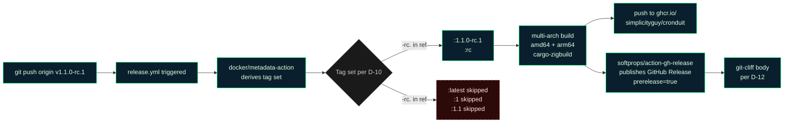

# Cutting a release-candidate tag

This document is the maintainer runbook for cutting a `vX.Y.Z-rc.N` pre-release tag (e.g., `v1.1.0-rc.1`). Read it before tagging — the steps below are linear and the tag is a one-way action (no force-push, no untag-and-retry; if you mess up, ship `rc.N+1`).

> Related documents: [`.planning/ROADMAP.md`](../.planning/ROADMAP.md), [`.planning/PROJECT.md`](../.planning/PROJECT.md), [`.github/workflows/release.yml`](../.github/workflows/release.yml), [`.github/workflows/compose-smoke.yml`](../.github/workflows/compose-smoke.yml), [`cliff.toml`](../cliff.toml), [`docs/CI_CACHING.md`](./CI_CACHING.md).

## Why this matters

Cronduit ships v1.1+ via iterative release candidates (`v1.1.0-rc.1`, `v1.1.0-rc.2`, `v1.1.0-rc.3`) before the final `v1.1.0` tag. Each rc is the canonical artifact operators install for early-adopter testing. Two invariants the rc cut MUST preserve:

1. **`:latest` stays pinned to the most recent stable release** until the final non-rc tag ships. As of v1.1's milestone-in-progress, that pin is `v1.0.1`. The `.github/workflows/release.yml` patch from Phase 12 D-10 enforces this automatically — `:latest` is gated to skip on any tag containing a hyphen.
2. **The tag is the trust anchor.** Per Phase 12 D-13, tags are cut **locally by the maintainer**, NOT by `workflow_dispatch`. This keeps the signing key (and therefore the attestation chain) outside GitHub Actions' runner identity. A future supply-chain compromise of GHA cannot retroactively spoof a tag.

If either invariant breaks, every consumer of `:latest` is at risk. Hence: read this runbook, do not skip steps.

## Pre-flight checklist

Before running `git tag`:

- [ ] **All scoped PRs merged to `main`.** Confirm via `gh pr list --state merged --base main --search "milestone:v1.1"` (or equivalent for the current milestone).
- [ ] **`compose-smoke` workflow green on the merge commit of `main`.** Confirm via `gh run list --workflow=compose-smoke.yml --branch=main --limit=1` — the most recent run on `main` must be `completed/success`.
- [ ] **`ci` workflow green on the same `main` commit.** Confirm via `gh run list --workflow=ci.yml --branch=main --limit=1`.
- [ ] **`Cargo.toml` version matches the tag you're about to cut.** Open `Cargo.toml` and confirm `version = "1.1.0"` (or whatever the current rc series targets). If `Cargo.toml` says `1.1.0` and you are about to cut `v1.1.0-rc.1`, that is correct (the `-rc.N` suffix is the *tag* notation; the in-source version remains the unsuffixed milestone version per Phase 10 D-12).
- [ ] **`git-cliff --unreleased` preview makes sense as release notes.** Run:
  ```bash
  git fetch --tags
  git cliff --unreleased --tag v1.1.0-rc.1 -o /tmp/release-rc1-preview.md
  cat /tmp/release-rc1-preview.md
  ```
  Read the output critically. If a section is empty or a feature is mis-categorized, fix the conventional-commit messages on `main` *before* tagging — per D-12, `git-cliff` output is authoritative; do NOT hand-edit the GitHub Release body after publish.
- [ ] **Local checkout is on `main` at the merge-commit you want to tag.** Run `git checkout main && git pull --ff-only origin main` then `git log -1 --oneline` and confirm the SHA matches the merge commit of the final scoped PR.

## Cutting the tag

The runbook handles two GPG configurations: (a) the maintainer has a GPG signing key configured, (b) the maintainer does not. Both produce valid annotated tags; (a) additionally signs.

### Step 1 — GPG pre-flight (decide signed vs unsigned)

Check whether your local git is configured to sign tags:

```bash
git config --get user.signingkey
```

- **If the command outputs a key ID** (e.g., `0xABCDEF1234567890`) → use the **signed** path (Step 2a).
- **If the command outputs nothing** → use the **unsigned-but-annotated** path (Step 2b). This is still a valid attestation (annotated tags carry tagger identity + timestamp + message); signing is an additional layer of cryptographic non-repudiation.

> If you'd like to set up GPG signing before cutting your first rc, GitHub's [Signing tags](https://docs.github.com/en/authentication/managing-commit-signature-verification/signing-tags) doc walks through `gpg --gen-key` + `git config --global user.signingkey` + `git config --global tag.gpgSign true`. Then come back here.

### Step 2a — Signed annotated tag (preferred)

Replace `1.1.0-rc.1` with the actual rc number you're cutting:

```bash
git tag -a -s v1.1.0-rc.1 -m "v1.1.0-rc.1 — release candidate"
```

The `-a` flag forces an annotated tag (vs lightweight); `-s` signs with your configured GPG key. Verify the signature locally before pushing:

```bash
git tag -v v1.1.0-rc.1
```

You should see `gpg: Good signature from "..."` and `gpg: aka "..."`. If the signature fails verification, do NOT push — investigate the GPG keyring first.

### Step 2b — Unsigned annotated tag (fallback)

```bash
git tag -a v1.1.0-rc.1 -m "v1.1.0-rc.1 — release candidate"
```

Verify the tag is annotated (not lightweight):

```bash
git cat-file tag v1.1.0-rc.1
```

You should see a `tag` object with `tagger`, `tagger date`, and the message. If the output is a `commit` object instead, the `-a` flag was missed — delete the tag (`git tag -d v1.1.0-rc.1`) and re-run Step 2b.

### Step 3 — Push the tag

```bash
git push origin v1.1.0-rc.1
```

This kicks off `.github/workflows/release.yml`. The workflow does the following automatically:



Watch the workflow run live:

```bash
gh run watch --exit-status
```

When the workflow finishes green, proceed to post-push verification.

## Post-push verification

These checks are **user-validated**, not Claude-self-asserted (per the project's `feedback_uat_user_validates.md` rule). Run them yourself; do not delegate to a CI step that "asserts" the rc was published correctly.

| Check | Command | Expected |
|-------|---------|----------|
| `:1.1.0-rc.1` tag landed in GHCR | `docker manifest inspect ghcr.io/simplicityguy/cronduit:1.1.0-rc.1` | JSON manifest with two platforms (`linux/amd64`, `linux/arm64`). |
| `:rc` rolling tag points at the same digest | `docker manifest inspect ghcr.io/simplicityguy/cronduit:rc` | Manifest digest IDENTICAL to the digest from the `:1.1.0-rc.1` inspect. |
| `:latest` is unchanged from the previous stable | `docker manifest inspect ghcr.io/simplicityguy/cronduit:latest` | Manifest digest equal to the `v1.0.1` digest from before the rc cut. (You can confirm via the GHCR package page UI: `:latest` should still link to the v1.0.1 release.) |
| `:1`, `:1.1` are unchanged | `docker manifest inspect ghcr.io/simplicityguy/cronduit:1` and `:1.1` | Both still resolve to the previous stable digest. (If the rc.1 push had bumped them, the D-10 invariant is broken — file a hotfix PR immediately.) |
| GitHub Release marked prerelease | `gh release view v1.1.0-rc.1 --json isPrerelease --jq .isPrerelease` | `true` |
| Release body matches `git-cliff` preview | `gh release view v1.1.0-rc.1 --json body --jq .body \| diff - /tmp/release-rc1-preview.md` | No diff (or only whitespace differences). |
| Multi-arch image runs locally on your platform | `docker run --rm ghcr.io/simplicityguy/cronduit:1.1.0-rc.1 --version` | Outputs `cronduit 1.1.0`. |
| Healthy in the shipped compose stack | `docker compose -f examples/docker-compose.yml up -d` (with `image:` overridden to `:1.1.0-rc.1`) → `docker compose ps` after 90 s | `Up N seconds (healthy)`. |

If any check fails, see "What if UAT fails" below.

## What if UAT fails

The cardinal rule: **never force-push a tag, never delete-and-retag**. The semver pre-release notation exists for exactly this scenario.

If UAT discovers a critical issue with `v1.1.0-rc.1`:

1. **Fix the issue on `main`** via a normal feature branch + PR (per `feedback_no_direct_main_commits.md`).
2. **Cut `v1.1.0-rc.2`** following this same runbook from the top.
3. **Leave `v1.1.0-rc.1` published.** It stays as a historical artifact; operators who pulled it can compare against the new rc to verify the fix.
4. **Communicate.** Update the GitHub Release notes for `v1.1.0-rc.1` with a one-line `> ⚠️ Superseded by v1.1.0-rc.2 — see [link]` callout (this is the ONE acceptable hand-edit to a published release body).

If UAT discovers a *minor* issue (typo in release notes, missing CHANGELOG line):

1. Fix the conventional-commit messages on `main` via a normal PR.
2. Re-run `git cliff --unreleased --tag v1.1.0-rc.2` for the *next* rc.
3. Do NOT hotfix-tag the existing rc.1.

## References

- **Phase 12 plan**: `.planning/phases/12-docker-healthcheck-rc-1-cut/12-CONTEXT.md` — full decision context (D-10 metadata-action patch, D-11 this runbook, D-12 changelog policy, D-13 maintainer-cut rationale).
- **rc cut schedule**: `.planning/ROADMAP.md` § "rc cut points" — which rc cuts at which phase boundary.
- **`:latest` pinning rationale**: `.planning/PROJECT.md` § Current Milestone — why `:latest` stays at v1.0.1 through rcs.
- **GHA workflow patches**: `.github/workflows/release.yml` (D-10) and `.github/workflows/compose-smoke.yml` (D-09).
- **CHANGELOG configuration**: `cliff.toml` — git-cliff config; do NOT hand-customize for individual rc cuts (D-12).
- **Project tag-format convention**: full semver `vX.Y.Z-rc.N` with the dot before `rc.N`. NEVER `vX.Y.Z-rcN` (no dot) — `git-cliff` and `docker/metadata-action` both rely on the dot for correct prerelease detection.

---

*This runbook applies to v1.1.0-rc.1, v1.1.0-rc.2, v1.1.0-rc.3, and any future `vX.Y.Z-rc.N` cut. For the final non-rc ship (e.g., `v1.1.0`), the metadata-action patch from Phase 12 D-10 automatically restores the standard tag set (`:1.1.0`, `:1.1`, `:1`, `:latest`) and SKIPS the `:rc` tag — you do not need a separate runbook.*
